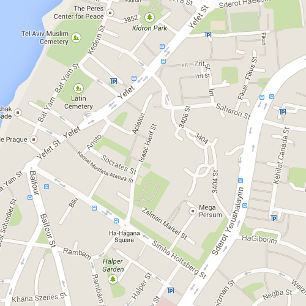
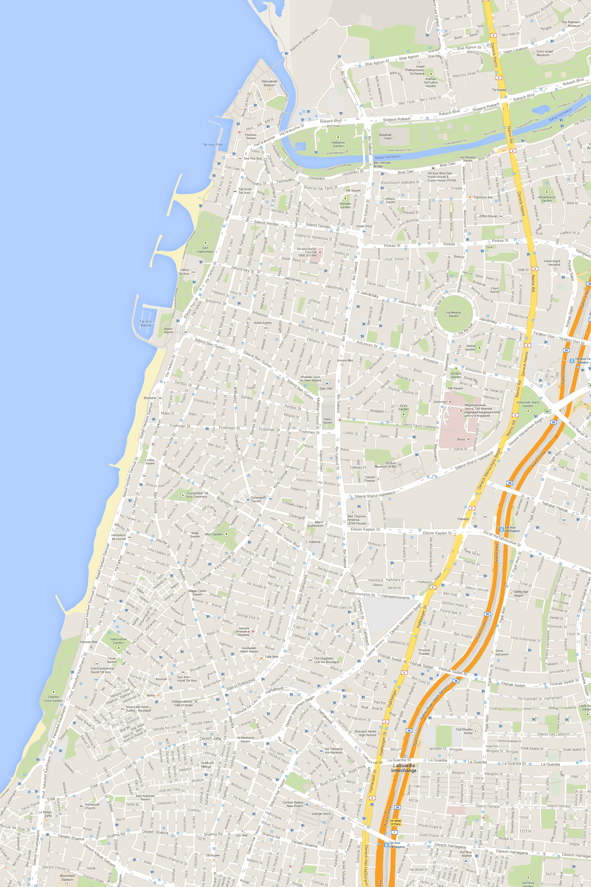
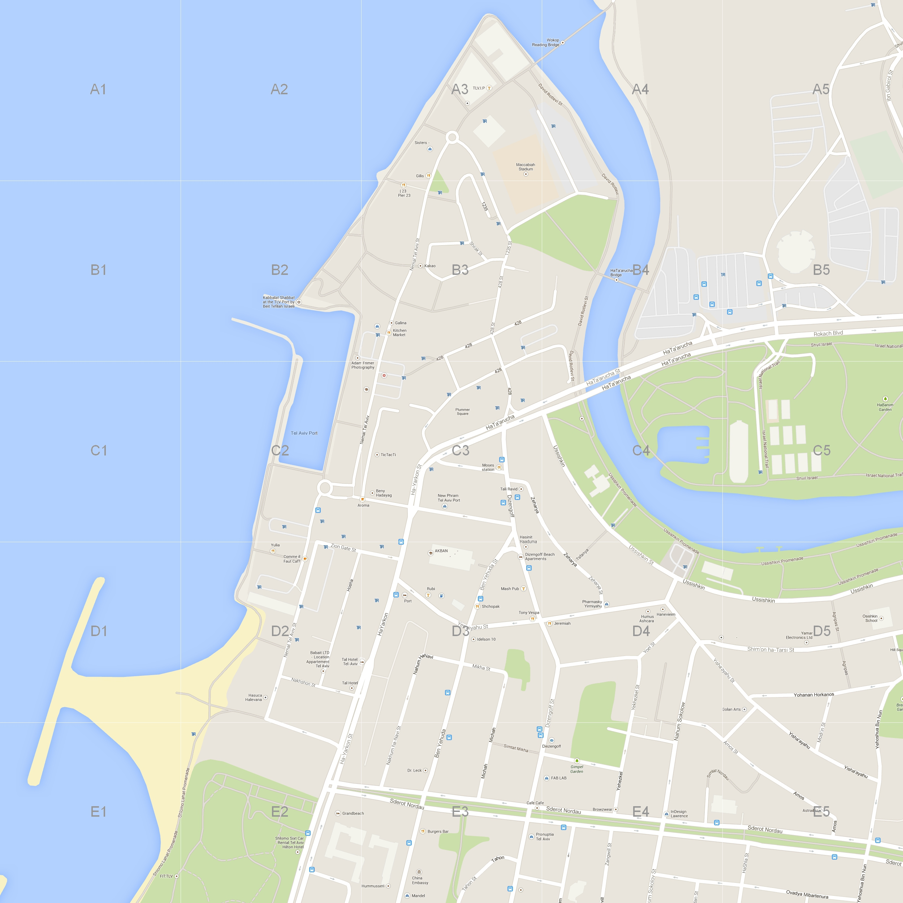
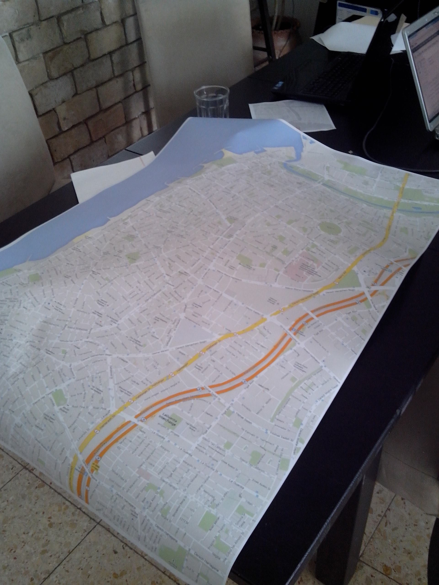

BigMapMaker
---

Several years ago I worked for a Texan couple who immigrated to Israel with the goal of opening Subway restaurants all over the country. My memory of working for them is happy - and I still appreciate the opportunity to freely come up with and develop business solutions to make their lives easier.

One of these solutions was BigMapMaker - and I present it here not because it's special, rather because I would like to preserve it and GitHub is a great place for that.

One day, my boss came up to me and said: "Hey, where can I get a big map of Tel Aviv?". "Why?", I asked. "I want to hang it up on the wall and mark places of interest". "Hmm.. that sounds very useful", I said. You could mark possible rentals, current competitors and other useful locations.

So I set out looking to purchase a very large map of Tel Aviv. Apparently, that's not a straightforward task. To make a long story short, whatever maps I could buy were too small, not detailed enough - and very expensive. Giant maps are just not a common purchase.

To solve our problem, I came up with the following solution - since there's nothing stopping someone from manually taking a bunch of screenshots of a map on Google Maps and then stitching them together, why not automate the process?

Let's start with taking a boxed screenshot of Google Maps. If we take many small images like this we can use them as tiles in a much larger map.

Once we have all of our tiles we can assemble them into one large map.

In addition, you can lay a grid on top of your image.
That way, you can use coordinates to refer to specific locations on your map.

Once we had the resulting map files, all that was left was to take them to a print shop and have them printed on their largest piece of paper.

***Disclaimer for Google*** - please don't sue me. *Thank you*.
